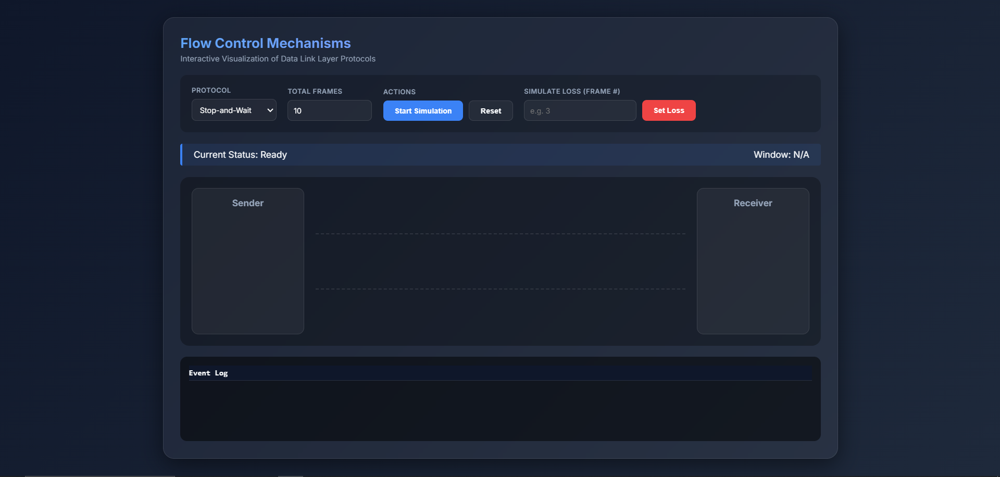

# Flow Control Mechanisms in Computer Networks

A comprehensive academic mini-project implementing Data Link Layer flow control protocols using C and simulating them with a web-based visualization.




## 📌 Project Overview

This project demonstrates the working principles of **Flow Control Mechanisms** in Computer Networks. It includes a **Terminal-based C Program** for logic simulation and an **Interactive Web Visualization** to conceptually understand the frame transmission process.

### Implemented Protocols
1. **Stop-and-Wait Protocol**: Simple send-and-wait mechanism.
2. **Sliding Window Protocol**: Sends multiple frames within a window size.
3. **Go-Back-N Protocol**: Retransmits N frames upon loss.
4. **Selective Repeat Protocol**: Retransmits only the lost frame.

---

## 🛠 Features

- **Menu-Driven Interface**: Easy-to-use command line menu.
- **Logic-Based Simulation**: Simulates frame loss and retransmission without complex socket programming.
- **Cross-Platform**: Runs on Linux, macOS, and Windows.
- **Interactive Visualization**: A bonus HTML/CSS/JS layer to visualize packet flow.
- **Clean Code**: Well-commented, beginner-friendly C code using standard libraries.

---

## 📂 Project Structure

```
Flow-Control/
│
├── src/
│   └── flow_control.c       # Main C Source Code
│
├── visualization/           # Web-based Visualization Layer
│   ├── index.html
│   ├── style.css
│   └── script.js
│
├── README.md                # Project Documentation
└── LICENSE.txt              # Usage License
```

---

## 🚀 How to Run the C Program

### Prerequisites
- GCC Compiler (or any standard C compiler)
- Terminal/Command Prompt

### Compilation & Execution
1. Navigate to the source directory:
   ```bash
   cd src
   ```
2. Compile the program:
   ```bash
   gcc flow_control.c -o flow_control
   ```
3. Run the executable:
   - **Windows**:
     ```bash
     flow_control.exe
     ```
   - **Linux/macOS**:
     ```bash
     ./flow_control
     ```

### Sample Menu Output
```text
---------------------------------
FLOW CONTROL SIMULATION MENU
---------------------------------
1. Stop-and-Wait Protocol
2. Sliding Window Protocol
3. Go-Back-N Protocol
4. Selective Repeat Protocol
5. Exit
Enter your choice: 
```

---

## 🌐 Optional Visualization

The `visualization/` folder contains a static web page that demonstrates these protocols visually.

### How to Use
1. Open the `visualization` folder.
2. Double-click `index.html` to open it in any web browser (Chrome, Firefox, Edge).
3. Select a protocol, set frame count, and click **Start Simulation**.
4. Use the "Simulate Loss" feature to see how protocols handle lost frames.

*Note: The visualization is logic-independent of the C program and is for educational demonstration only.*

### Deployment (Vercel/Netlify)
This folder is ready for static hosting. Simply drag and drop the `visualization` folder to Vercel or Netlify to share it online.

---

## 💻 Technologies Used

- **Language**: C (Standard `stdio.h`, `stdlib.h`)
- **Web Layer**: HTML5, CSS3 (Glassmorphism), JavaScript (ES6+)
- **Tools**: GCC, Visual Studio Code

---

## 👤 Author

**PRIYAM KAPADIYA**  

---

## 📜 License

This project is licensed under the Educational Use License. See standard [LICENSE.txt](LICENSE.txt) for details.
